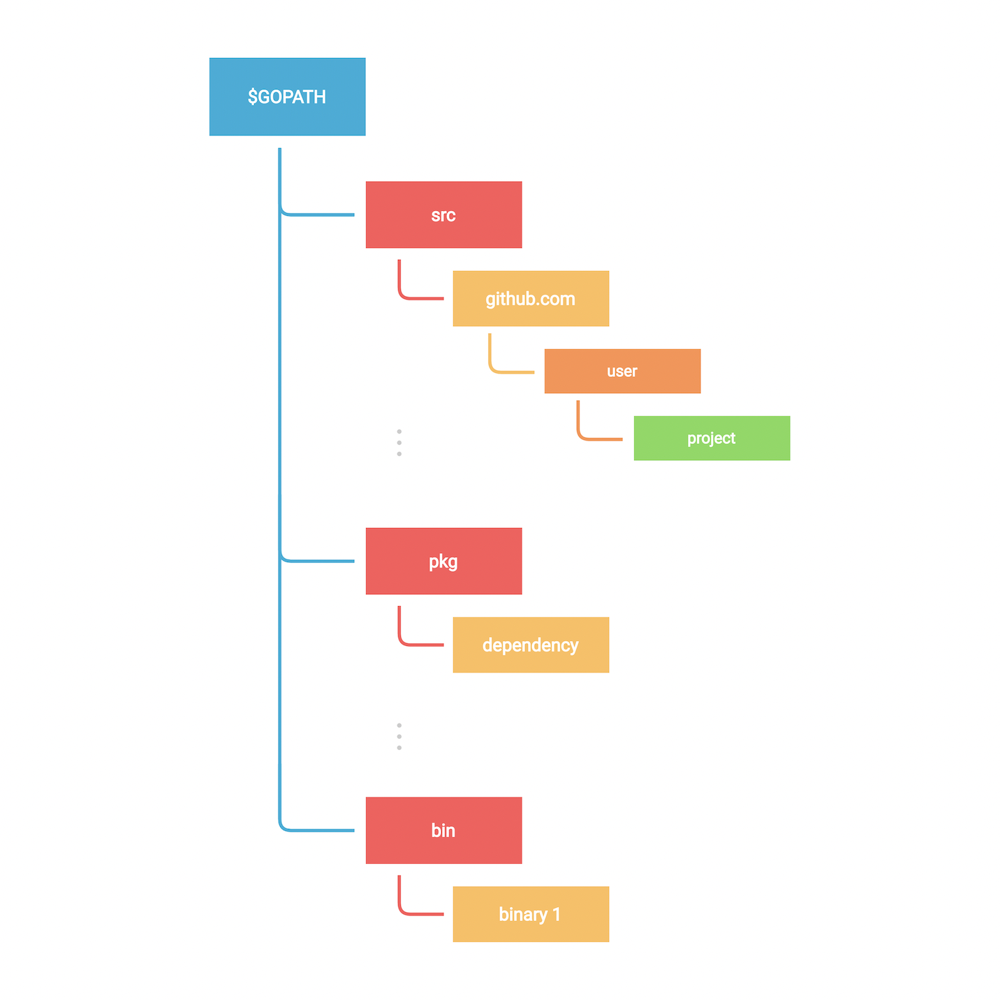
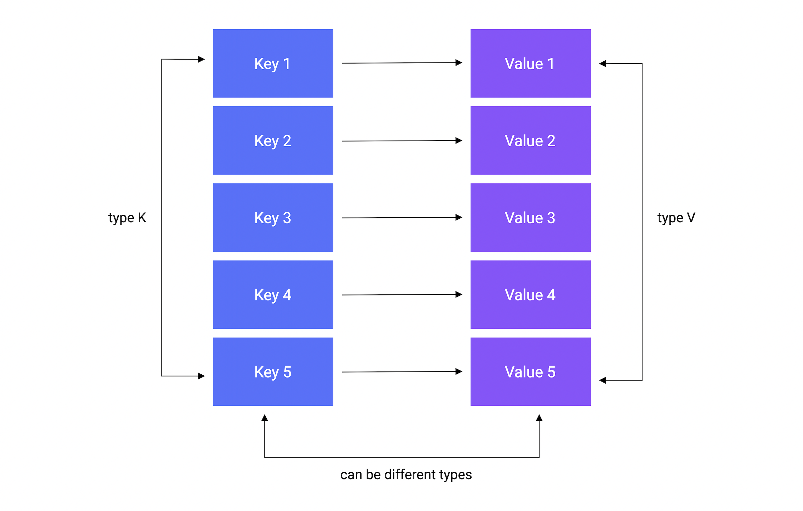
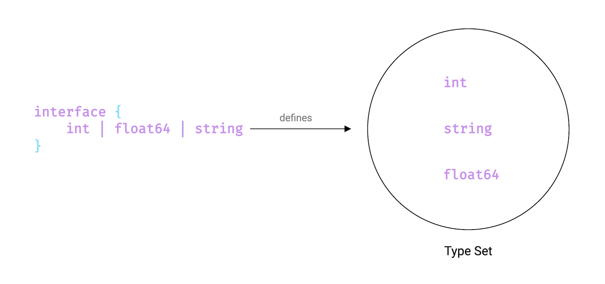
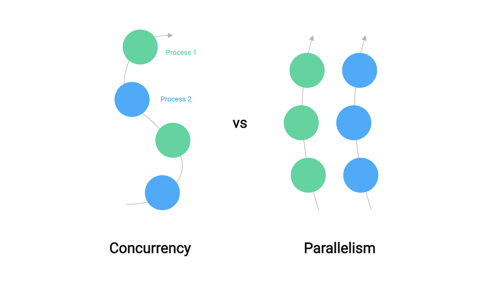

# Chapter 1 of golang Core

- [Chapter 1 of golang Core](#chapter-1-of-golang-core)
  - [Variables and Data Types](#variables-and-data-types)
    - [Variables](#variables)
  - [Constants](#constants)
  - [Data Types](#data-types)
    - [String](#string)
    - [Bool](#bool)
      - [Operators](#operators)
    - [Numeric types](#numeric-types)
      - [Signed and Unsigned integers](#signed-and-unsigned-integers)
      - [Byte and Rune](#byte-and-rune)
      - [Floating point](#floating-point)
      - [Operators](#operators-1)
      - [Complex](#complex)
    - [Zero values](#zero-values)
    - [Type Conversion](#type-conversion)
    - [Alias types](#alias-types)
    - [Defined types](#defined-types)
  - [String Formatting](#string-formatting)
  - [Flow control](#flow-control)
    - [If/Else](#ifelse)
    - [Compact if or short if](#compact-if-or-short-if)
    - [Switch](#switch)
    - [Loop](#loop)
      - [For loop](#for-loop)
      - [Break and continue](#break-and-continue)
      - [Forever loop](#forever-loop)
  - [Functions](#functions)
    - [Simple declaration](#simple-declaration)
    - [Returning the value](#returning-the-value)
    - [Multiple returns](#multiple-returns)
    - [Named return values](#named-return-values)
    - [Functions as values](#functions-as-values)
    - [Closures](#closures)
    - [Variadic Functions](#variadic-functions)
    - [Init](#init)
    - [Defer](#defer)
  - [Modules](#modules)
    - [What are modules?](#what-are-modules)
    - [Vendoring](#vendoring)
  - [Packages](#packages)
    - [What are packages?](#what-are-packages)
    - [External dependencies](#external-dependencies)
  - [Workspaces](#workspaces)
  - [Useful Commands](#useful-commands)
  - [Build](#build)
  - [Pointers](#pointers)
    - [Dereferncing](#dereferncing)
    - [Pointers as function args](#pointers-as-function-args)
    - [New function for initializing a pointer](#new-function-for-initializing-a-pointer)
    - [Pointer to a pointer](#pointer-to-a-pointer)
  - [Structs](#structs)
    - [Defining](#defining)
    - [Declaring and initalizing](#declaring-and-initalizing)
    - [Without field name](#without-field-name)
    - [Accessing fields](#accessing-fields)
    - [Exported fields](#exported-fields)
    - [Embedding and composition](#embedding-and-composition)
    - [Struct Tages](#struct-tages)
    - [Properties](#properties)
  - [Methods](#methods)
    - [Methods with pointer receivers](#methods-with-pointer-receivers)
    - [Properties](#properties-1)
    - [Why methods instead of functions?](#why-methods-instead-of-functions)
      - [When to use Each](#when-to-use-each)
  - [Arrays and Slices](#arrays-and-slices)
    - [Arrays](#arrays)
      - [Declaration](#declaration)
      - [Initialization](#initialization)
      - [Access](#access)
      - [Multi dimensional](#multi-dimensional)
    - [Properties](#properties-2)
    - [Slices](#slices)
      - [Declaration](#declaration-1)
      - [Initialization](#initialization-1)
      - [Iteration](#iteration)
      - [Function](#function)
        - [Copy](#copy)
        - [append](#append)
        - [Properties](#properties-3)
  - [Maps](#maps)
    - [Declaration](#declaration-2)
    - [Initialization](#initialization-2)
      - [make function](#make-function)
      - [map literal](#map-literal)
    - [Add](#add)
    - [Retrieve](#retrieve)
    - [Exists](#exists)
    - [Update](#update)
    - [Delete](#delete)
    - [Iteration](#iteration-1)
    - [Properties](#properties-4)
  - [Interfaces](#interfaces)
    - [What is an interface?](#what-is-an-interface)
      - [Definition](#definition)
      - [Why interfaces are important](#why-interfaces-are-important)
        - [Abstraction](#abstraction)
        - [Flexibility](#flexibility)
        - [Interface with Multiple Methods](#interface-with-multiple-methods)
        - [Empty Interfaces (any)](#empty-interfaces-any)
        - [Type Assertion](#type-assertion)
        - [Interface Composition](#interface-composition)
      - [Key Points to Remember](#key-points-to-remember)
    - [Empty Interface](#empty-interface)
    - [Type Assertion](#type-assertion-1)
    - [Nil Interfaces](#nil-interfaces)
      - [Tricky bug](#tricky-bug)
      - [How to avoid this](#how-to-avoid-this)
        - [Key Takeways](#key-takeways)
    - [Pointer vs Value Receivers with Interfaces](#pointer-vs-value-receivers-with-interfaces)
      - [Value Receiver](#value-receiver)
      - [Pointer Receiver](#pointer-receiver)
        - [Interface Example](#interface-example)
        - [Quick Rule](#quick-rule)
      - [Small Interfaces are Idiomatic Go](#small-interfaces-are-idiomatic-go)
    - [Type Switch](#type-switch)
    - [Properties](#properties-5)
      - [Zero values](#zero-values-1)
      - [Embedding](#embedding)
      - [Interface Values](#interface-values)
  - [Errors](#errors)
    - [Constructing Errors](#constructing-errors)
    - [Sentinel Errors](#sentinel-errors)
    - [Custom Errors](#custom-errors)
      - [What's the difference b/w "errors.Is" and "errors.As"?](#whats-the-difference-bw-errorsis-and-errorsas)
  - [Panic and Recover](#panic-and-recover)
    - [Panic](#panic)
    - [Recover](#recover)
    - [Use cases](#use-cases)
  - [Testing](#testing)
    - [Table driven tests](#table-driven-tests)
      - [Why use table-driven tests?](#why-use-table-driven-tests)
        - [Table-driven test](#table-driven-test)
          - [Key Concepts](#key-concepts)
    - [Code coverage](#code-coverage)
    - [Fuzz testing](#fuzz-testing)
  - [Generics](#generics)
    - [What are Generics?](#what-are-generics)
    - [we can define a generic function.](#we-can-define-a-generic-function)
    - [When to use generics?](#when-to-use-generics)
  - [Concurrency](#concurrency)
    - [Concurrency vs Parallelism](#concurrency-vs-parallelism)
    - [What is Concurrency](#what-is-concurrency)

## Variables and Data Types

### Variables

- Declaration without initialization:

```go
var name string
```

- Declaration with initialization:

```go
var name string = "Test""
```

- Multiple declaration:

```go
var var1, var2 string = "Hello", "world""
// OR
var (
    var1 string = "Hello""
    var2 string = "World"
)
```

- Type is omitted but will be inferred:

```go
var var1 = "what is type of this variable?"
```

- Here we omit `var` keyword and type is always implicit. This is how we will see variables being declared most of the time.
- We also use `:=` for declaration plus assignment.

```go
foo := "Shorthand!"
```

> [!NOTE]
> Shorthand only works inside `function` bodies

## Constants

Constant can be declare with the `const` keyword.

```go
const constant = "This is a constant" // value cannot be reassigned.
```

> [!NOTE]
> Only constants can be assigned to other constants.

```go
const a = 10
const b = a // ✅ Works

var a = 10
const b = a // ❌ a (variable of type int) is not constant (InvalidConstInit)
```

## Data Types

### String

- String = It's a sequence of bytes. They are declared either using double quotes or backticks which can span multiple lines.

```go
var name string = "My name is Go""

var bio string = `This is golang string type.
                Its a sequence of bytes.`
```

### Bool

- `bool` which is used to store boolean values. It can have two possible values - `true` or `false`.

```go
var value bool = false
var isItTrue bool = true
```

#### Operators

- we can use following operators on boolean types
  - Logical = `&&`, `||`, `!`
  - Equality = `==`, `!=`

### Numeric types

#### Signed and Unsigned integers

- Go has several built-in integer types of varying sizes for storing signed and unsigned integers.

- The size of generic `int` and `uint` types are platform-dependent. This means it is 32-bits wide on a 32-bit system and 64-bits wide on a 64-bit system.

```go
var i int = 404                     // Platform dependent
var i8 int8 = 127                   // -128 to 127
var i16 int16 = 32767               // -2^15 to 2^15 - 1
var i32 int32 = -2147483647         // -2^31 to 2^31 - 1
var i64 int64 = 9223372036854775807 // -2^63 to 2^63 - 1
```

- Similar to signed integers, we have unsigned integers.

```go
var ui uint = 404                     // Platform dependent
var ui8 uint8 = 255                   // 0 to 255
var ui16 uint16 = 65535               // 0 to 2^16
var ui32 uint32 = 2147483647          // 0 to 2^32
var ui64 uint64 = 9223372036854775807 // 0 to 2^64

var uiptr uintptr                     // Integer representation of a memory address
```

> [!NOTE]
> There's also an unsigned integer pointer `uintptr` type, which is an integer representation of a memory address. It is not recommended to use this.

> [!IMPORTANT]
> It is recommended that whenever we need an integer value, we should just use `int` unless we have a specific reason to use a `sized` or `unsigned` integer type.

#### Byte and Rune

- Golang has two additional types called `byte` and `rune` that are aliases for `uint8` and `int32` data types respectivly.

```go
type byte = uint8
type rune = int32
```

- A `rune` represents a unicode code point.

```go
var b byte = 'a'
var r rune = '🍕'
```

#### Floating point

- These are used to store numbers with a decimal component.
- Go has 2 floating point types `float32` and `float64`. Both type follows the IEEE-754 standard.

> [!NOTE]
> The default type for floating point values is float64.

```go
var f32 float32 = 1.7812 // IEEE-754 32-bit
var f64 float64 = 3.1415 // IEEE-754 64-bit
```

#### Operators

- Go providers several operators for performing operations on numeric types.

- **Arithmetic**: `+`, `-`, `*`, `/`, `%`
- **Comparison**: `==`, `!=`, `<`, `>`, `<=`, `>=`
- **Bitwise**: `&`, `|`, `ˆ`, `<<`, `>>`
- **Incre/Decre**: `++`, `--`
- **Assignment**: `=`, `+=`, `-=`, `*=`, `/=`, `%=`, `<<=`, `>>=`, `&=`, `|=`, `ˆ=`

#### Complex

There are 2 complex types in Go, `complex128` where both real and imaginary parts are `float64` and `complex64` where real and imaginary parts are `float32`.

we can define complex numbers either using the built-in complex function or as literals.

```go
var c1 complex128 = complex(10, 1)
var c2 complex64 = 12 + 4i
```

### Zero values

- In go, any variable declared without an explicit initial value is given its zero value.

```go
var i int
var f float64
var b bool
var s string

fmt.Printf("%v %v %v %q\n", i, f, b, s)
```

- `int` and `float`are assigned as `0`, `bool` as false, and `string` as an `empty string`.

### Type Conversion

```go
i := 32
f := float64(i)
u := uint(f)

fmt.Printf("%T %T", f, u)
```

> [!NOTE]
> This is different from parsing

### Alias types

- It allow you to interchangeably with the underlying type.

```go
package main
import "fmt"

type MyAlias = string
func main(){
    var str MyAlias = "I am an alias"
    fmt.Printf("%T - %s", str, str) // Output: string - I am an alias.
}
```

### Defined types

- Unlike `alias` types do not use an equals sign.

```go
package main
import "fmt"

type MyDefined string
func main() {
    var str MyDefined = "I am defined"
    fmt.Printf("%T -%s", str, str)  // Output: main.MyDefined - I am defined.
}
```

> [!NOTE]
> `defined types` do more than just give a name to a type.
> It first defines a new named type with an underlying type. However, this defined type is different from any other type. including its underlying type.
>
> Hence, It cannot be used interchangeably with the underlying type like alias types.

```go
// Example of defined type.
package main
import "fmt"

type MyAlias = string
type MyDefined string

func main(){
    var alias MyAlias
    var def MyDefined

    // ✅ Works
    var copy1 string = alias

    // ❌ Cannot use def (variable of type MyDefined) as string value in variable
    var copy2 string = def
    fmt.Println(copy1, copy2)
}

// as we can see, we cannot use the defined type interchangely with the underlying type, unlike alias types.
```

## String Formatting

- String formating or sometimes also known as templating.
- `fmt` package contains lots of functions. So to save time, we will discuss the most frequently used functions.

```go
// fmt.Print=> "Print" does not format anything, it simply takes a string and prints it.
fmt.Print("What", "is", "your", "name?")
fmt.Print("My", "name", "is", "golang")

// Println => It same as "Print", but it adds a new line at the end and also inserts space b/w the arguments.
fmt.Println("What", "is", "your", "name?")
fmt.Println("My", "name", "is", "golang")

// Printf => also knonw as "Print Formatter", which allows us to format numbers, strings, booleans and much more.
name:= "golang"
fmt.Println("What is your name?")
fmt.Printf("My name is %s", name)

// "%s" was substituted with name variable
// "%s", its called annotation verbs and they tell the function how to format the arguments. we can control things like width, types and precision with these and there are lots of them

percent := (7.0 / 9) * 100
fmt.Printf("%f", percent)       // o/p: 77.777778

// lets say we want just 77.78 which is 2 points precision, we can do that as well by using ".2f". Also, to add an actual percent sign, we will need to escape it.

fmt.Printf("%.2f %%", percent)
```

- `Sprint`, `Sprintln`, and `Sprintf`, these are basically the same as the print functions, the only difference being they can return the string instead of printing it.

```go
// example
s := fmt.Sprintf("hex:%x bin:%b", 10, 10)
fmt.Println(s)

// Sprintf formats our integer as hex or binary and returns it as a string.

// multiline string literals
msg := `
Hello from
multiline
`

fmt.Println(msg)
```

> [!NOTE]
> These String formatting examples are just tip so please checkout golang string formating [https://pkg.go.dev/fmt](https://pkg.go.dev/fmt)

## Flow control

### If/Else

- Works same as other programming languages, but the expression doesn't need to be surrounded by parentheses `()`.

```go
func main(){
  x := 10
  if x>5 {
    fmt.Println("x is gt 5")
  }else if x>10 {
    fmt.Println("x is gt 10")
  }else {
    fmt.Println("else case")
  }
}
```

### Compact if or short if

- we can also compact our if statements.

> [!NOTE]
> Go doen't have a special "short if" syntax or ternary operator (`? :`) like others, the idiomatic way to write concise unconditionals is to use the standard `if` statement with an optional **short statement** preceding the condition.

This format is commonly used for error handling. allowing a variable declaration (using `:=`) and a condition check in a single line. The variable's scope is limited to the `if` and corresponding `else` blocks.

```go
// syntax:
/**
if initialization; condition {
  // code block if condition is true
}else{
  // code block if condition is false
}
*/

func main(){
  if x:=10; x>5{
    fmt.Println("x is gt 5")
  }
}
```

```go
// error handling
import (
  "fmt"
  "os"
)

func main(){
  // The short statement opens a file and assigns the file handle and potential error.
  if file, err := os.open("example.txt"); err != nil {
    fmt.Println("Error opening file", err)
    // err is in scope here
  }else{
    fmt.Println("File opened successfully")
    file.close()
    // file and err are in scope here
  }
  // file and err are NOT in scope here and cannot be used.
}
```

### Switch

- In Go, the switch case only runs the first case whose value is equal to the condition expression and not all the cases that follow. Hence, unlike other languages, `break` statement is automatically added at the end of each case.

- It evaluates cases from top to bottom, stopping when a case succeeds.

```go
func main(){
  day:="monday"

  switch day{
    case "monday":
      fmt.Println("time to work!")
    case "friday":
      fmt.Println("let's party")
    default:
      fmt.Println("browse memes")
  }
}
```

- Go also support shorthanded declaration like this.

```go
switch day := "monday"; day{
  case "monday":
    fmt.Println("time to work!")
  case "friday":
    fmt.Println("let's party")
  default:
    fmt.Println("browser memes")
}
```

> [IMPORTANT]
>
> - `fallthrough` keyword to transfer control to the next case even though the current case might have matched.

```go
switch day:= "monday"; day{
  case "monday":
    fmt.Println("time to work!")
    fallthrough
  case "friday":
    fmt.Println("let's party")
  default:
    fmt.Println("browse memes")
}
// if we run this, we'll see that after the first case matches the switch statement continues to the next case because of the `fallthrough`keyword.
// o/p: time to work!
// o/p: let's party
```

- we can also use it without any condition, which is same as `switch true`

```go
x := 10
switch {
  case x > 5:
    fmt.Println("x is greater")
  default:
    fmt.Println("x is not greater")
}
```

### Loop

- Go, have only one type of loop which is `for` loop. And it doesn't need any parenthesis `()` unlike others.

#### For loop

- `init statement`: which is executed before the first iteration.
- `condition expression`: which is evaluated before every iteration.
- `post statement`: which is executed at the end of every iteration.

```go
func main(){
  for i:=0; i<10; i++{
    fmt.Println(i)
  }
}
```

#### Break and continue

- Go also supports both `break` and `continue` statements for loop control.

```go
func main(){
  for i:=0; i<10; i++{
    if i<2 {
      continue
    }
    fmt.Println(i)
    if i > 5{
      break
    }
  }
  fmt.Println("we broke out!")
}
```

So, the `continue` statement is used when we want to skip the remaining portion of the loo, and `break` statement is used when we want to break out of the loop.

> [!NOTE]
> `Init` and `post` statements are optional, hence we can make out `for` loop behave like a while loop as well.

```go
func main(){
  i:=0
  for ;i < 10;{ // we can also remove the additional semi-colons to make it a little cleaner.
    i += 1
  }
}
```

#### Forever loop

- If we omit the loop condition, it loops forever, so an infinite loop can be compactly expressed. This is also known as the forever loop.

```go
func main(){
  for {
    // do stuff here
  }
}
```

## Functions

### Simple declaration

```go
 `func myFunction() {}`
```

- And we can call or execute it as follows.

```go
myFunction()
```

```go
func main(){
  myFunction("Hello")
}
func myFunction(p1 string){
  fmt.Println(p1)
}
```

- when consecutive parameters have the same type.

```go
func myNextFunction(p1, p2 string) {}
```

### Returning the value

```go
func main(){
  s := myFunction("Hello")
  fmt.Println(s)
}

func myFunction(p1 string) string {
  msg := fmt.Sprintf("%s function", p1)
  return msg
}
```

### Multiple returns

```go
func main(){
  s, i := myFunction("Hello")
  fmt.Println(s, i)
}

func myFunction(p1 string) (string, int) {
  msg := fmt.Sprintf("%s function", p1)
  return msg, 10
}
```

### Named return values

- Go's return value may be named. If so, they are treated as variables defined at the top of the function.

- These names should be used to document the meaning of the return values.

- A `return` statement without arguments the named return values.

> [!NOTE]
> Naked return statements should be used only in short functions.

```go
package main
import "fmt"

func split(sum int)(x, y int){
  x = sum * 4 / 9
  y = sum - x
  return  // return statement without any arguments, this is also known as **naked returns**
}

func main(){
  fmt.Println(split(17))
}
```

### Functions as values

- In Go, we can use functions as values.

```go
func myFunction(){
  fn := func(){
    fmt.Println("Inside fn")
  }
  fn()
}

// Simplified version of above code.
func myFunction(){
  func(){
    fmt.Println("Inside fn")
  }()
}
// Notice how we execute it using the parenthesis at the end.
```

### Closures

- A closure is a function that references variables from outside of its body.

- Closures are lexically scoped, which means functions can access the values in scope when defining the function.

```go
func myFunction() func(int) int{
  sum := 0
  return func(v int) int {
    sum += v
    return sum
  }
}

...
add := myFunction()
add(5)
fmt.Println(add(10))
...
```

### Variadic Functions

which are functions that can take zero or multiple arguments using the `...` ellipses operator.

```go
func main(){
  sum := add(1,2,3,5)
  fmt.Println(sum)
}

func add(values ...int) int {
  sum := 0
  for _, v := range values{
    sum += v
  }
  return sum
}
```

> [!IMPORTANT]
> `fmt.Println` is a variadic function, that's how we were able to pass multiple values to it.

### Init

`init` is a special lifecycle function that is executed before the `main` function.

the `init` function does not take any arguments nor returns any value.

```go
package main
import "fmt"

func init(){
  fmt.Println("Before main!")
}

func main(){
  fmt.Println("Running main")
}
```

- `init` function was executed before the `main` function.

> [!IMPORTANT]
> There can be more than one `init` function in single or multiple files.
> For multiple `init` in a single file, their processing is done in the order of their declaration, while `init` functions declared in multiple files are processed according to the lexicographic filename order.

```go
package main

import "fmt"

func init(){
  fmt.Println("Before main!")
}

func init(){
  fmt.Println("Hello again")
}

func main(){
  fmt.Println("Running main")
}
```

> [!IMPORTANT]
> The `init` function is optional and is particularly used for any global setup which might be essential for our program, such as establishing a database connection, fetching configuration files, setting up environment variables, etc.

### Defer

the `defer` keyword, which lets us postpones the execution of a function until the surrounding function returns.

```go
func main(){
  defer fmt.Println("I am finished")
  fmt.Println("Doing some work....")
}
```

we can use multiple `defer` functions, using multiple `defer` brings us to what is known as `defer stack`.

```go
func main(){
  defer fmt.Println("I am finished")
  defer fmt.Println("Are you?")

  fmt.Println("Doing some work...")
}

//o/p:
// Doing some work...
// Are you?
// I am finished.

```

As we can `defer statements` are stacked and executed in LIFO manner.

So, Defer is incredibly useful and is commonly used for doing cleanup or error handling.

Functions can also be used with generics.

## Modules

### What are modules?

A module is a collection of [Go packages](https://go.dev/ref/spec#Packages) stored in a file tree with a `go.mod` file at its root, provided the directory is outside `$GOPATH/src`.

Go modules were introduced in Go 1.11, which brings native support for versions and modules.

> [!IMPORTANT]
> `GOPATH` is a variable that defines the root of your workspace and it contains the following folders:
>
> - **src**: contains Go source code orgnaized in a hierarchy.
> - **pkg**: contains compiled package code.
> - **bin**: contains compiled binaries and executables.
>   

- Create a new module using `go mod init` command which creates a new module and initializes the go.mod file that describes it.
  `go mod init example`

The important thing to note here is that Go module can correspond to a Github repository as well if you plan to publish this module. For example:
`go mod init example`

- `go.mod` which is the file that defines the module's module path and also the import path used for the root directory, and its dependency requirements.

```go
module <name>
go <version>

require (
  ...
)
```

And if we want to add a new dependency, we will use `go install` command:

- `go install github.com/rs/zerolog`

- `go.sum` file was also created. This file contains the expected hashes of the content of the new modules.

- `go list -m all`
- If the dependency is not used, we can simply remove it using `go mod tidy`

### Vendoring

Vendoring is the act of making your own copy of the 3rd party packages your project is using. Those copies are traditionally placed inside each project and then saved in the project repository.

This can be done through `go mod vendor` command.

- After the `go mod vendor` command is executed, a `vendor` directory will be created.

```bash
├── go.mod
├── go.sum
├── go.work
├── main.go
└── vendor
    ├── github.com
    │   └── rs
    │       └── zerolog
    │           └── ...
    └── modules.txt
```

## Packages

### What are packages?

A package is nothing but a directory containing one or more Go source files, or other Go packages.

This means every Go source file must belong to a package and package declaration is done at top of every source file as follows.

`package <package_name>`

so far, we've done everything inside of `package.main`. The `main` package should also contain a `main()` function which is a special function that acts as the entry point of an executable program.

> [!NOTE]
> Go also has a concept of imports and exports but it's very elegant.
> Basically, any value (like a variable or function) can be exported and visible from other packages if they have been defined with an upper case identifier.

- Example:

```go
package custom

var value int = 10    // Will not be exported.
var Value int = 20    // Will be exported.
```

- As we can see lower case identifiers will not be exported and will be private to the package it's defined in. In our case the `custom` package.

Here we can refer to it using the `module` we had initialized in our `go.mod` file earlier.

```go
----go.mod----
module example

go 1.18

----main.go----
package main
import "example/custom"

func main(){
  custom.Value
}
```

- Notice how the package name is the last name of import path.
- we can import multiple packages as well like this:

```go
package main

import (
  "fmt"
  "example/custom"
)

func main(){
  fmt.Println(custom.Value)
}
```

- we can also alias our imports to avoid collisions like this.

```go
package main

import (
  "fmt"
  abcd "example/custom"
)

func main(){
  fmt.Println(abcd.Value)
}

```

### External dependencies

- In go we can install external packages using `go install` command as we saw earlier.

`go install github.com/rs/zerolog`

```go
package main

import (
  "github.com/rs/zerolog/log"
  abcd "example/custom"
)

func main(){
  log.Print(abcd.Value)
}
```

> [IMPORTANT]
> Make sure to check out the go doc of packages you install, which is usally located in the project's readme file. go doc parses the source code and generates documentation in HTML format. Reference to it is usually located in readme files.

> [!NOTE]
> Go doesn't have a particular "folder structure" convention, always try your best to organize your packages in a simple and intuitive way.

## Workspaces

- multi-module workspaces were introduced in Go 1.18.
- Workspaces allow us to work with multiple modules simultaneously without having to edit `go.mod` files for each module. Each module within a workspace is treated as a root module when resolving dependencies.

```bash
# hello module
mkdir workspace && cd workspaces
mkdir hello && cd hello
go mod init hello
```

```go
package main

import (
  "fmt"
  "golang.org/x/example/stringutil"
)

func main(){
  result := stringutil.Reverse("Hello Workspace")
  fmt.Println(result)
}
```

```bash
$ go get golang.org/x/example
go: downloading golang.org/x/example v0.0.0-20220412213650-2e68773dfca0
go: added golang.org/x/example v0.0.0-20220412213650-2e68773dfca0


$ go run main.go
ecapskroW olleH
```

- WHat if we want to modify the `stringutil` module that our code depends on?
- Until now, we had to do it using the `replace` directive in the `go.mod` file, but now let's see how we can use `workspaces` directory.

- `go work init`

- This will create a `go.work` file.

```bash
cat go.work
go 1.18
```

- we will also add our `hello` module to the workspace.

- `go work use ./hello`

- This should update the `go.work` file with a reference to our `hello` module.

```bash
go 1.18
use ./hello
```

- download and modify the `stringutil` package and update the `Reverse` function implementation.

```bash
$ git clone https://go.googlesource.com/example
Cloning into 'example'...
remote: Total 204 (delta 39), reused 204 (delta 39)
Receiving objects: 100% (204/204), 467.53 KiB | 363.00 KiB/s, done.
Resolving deltas: 100% (39/39), done.
```

`example/stringutil/reverse.go`

```go
func Reverse(s string) string{
  return fmt.Sprintf("I can do whatever!! %s", s)
}
```

Finally, let's add `example` package to our workspace.

```bash
$ go work use ./example
$ cat go.work
go 1.18

use (
	./example
	./hello
)

# now if we run our hello module we will notice that the Reverse function has been modified.

go run hello
I can do whatever!! Hello Workspace
```

## Useful Commands

- `go fmt` which formats the source code and it's enforced by that language so that we can focus on how our code should work rather than how our code should look.

- `go vet` which reports likely mistakes in our packages.

- `go env` which simply prints all the go environment information.

- `go doc` which shows documentation for a package or symbol.
  - `go doc -src fmt Printf`

- `go help` command to see what other commands are available.

- `go fix` finds Go programs that use old APIs and rewrites them to use newer ones.
- `go generate` is usually used for code generation.
- `go install` compiles and installs packages and dependencies.

- `go clean` is used for cleaning files that are generated by compilers.

etc.

## Build

Building static binaries is one of the best features of Go which enables us to ship our code efficiently.

- we can do this very easily using the `go build` command.

```go
package main

import "fmt"
func main(){
  fmt.Println("I am a binary!")
}
```

- `go build` this should produce a binary with the name of our module.
- `go build -o app`

```bash
# Now to run this, we simply need to execute it.
./app
I am a binary!
```

> [I!IMPORTANT]
> Some important build time variables, starting with:
> `GOOS` and `GOARCH`
> These envionment variables help us build go programs for different operating systems and underlying processor architectures.

```bash
# we can list all the supported architecture using "go tool" command.

go tool dist list
android/amd64
ios/amd64
js/wasm
linux/amd64
windows/arm64
...
```

- An example for building a windows executable from macOS!
  - `GOOS=windows GOARCH=amd64 go build -o app.exe`
  - `CGO_ENABLED`
    This variable allows us to configure [CGO](https://go.dev/blog/cgo), which is a way in Go to call C code.
    This helps us to produce a statically linked binary that works without any external dependencies.

- When we want to run our go binaries in a Docker container with minimum external dependencies.
  - `CGO_ENABLED=0 go build -o app`

## Pointers

A pointer is a variable that is used to store the memory address of another variable.

It can be used like this:
`var x *T`

Where `T` is the type such as `int`, `string`, `float`, and so on.

```go
package main
import "fmt"

func main(){
  var p *int
  fmt.Println(p)
}
```

o/p: `nil`

> [!NOTE]
> `nil` is a predeclared identifier in Go that represents zero value for `pointer`, `interfaces`, `channels`, `maps` and `slices`.

```go
package main
import "fmt"

func main(){
  a := 10
  var p *int = &a
  fmt.Println("address: ", p)
}
```

- we use the `&` ampersand operator to refer to a variable's memory address.

### Dereferncing

we can also use the `*` asterisk operator to retrieve the value stored in the variable that the pointer points to. This is also called dereferncing.

```go
package main
import "fmt"

func main(){
  a:=10
  var p *int = &a
  fmt.Println("address:", p)
  fmt.Println("value:", *p)
}
```

- we can change it as well through the pointer.

```go
package main

import "fmt"

func main(){
  a := 10
  var p *int = &a
  fmt.Println("before", a)
  fmt.Println("address", p)

  *p = 20
  fmt.Println("after:", a)
}
```

### Pointers as function args

Pointer can also be used as arguments for a function when we need to pass some data by refernce.

```go
myFunction(&a)
...
func myFunction(ptr *int) {}
```

### New function for initializing a pointer

we use the `new` function which takes a type as an argument, allocates enough memory to accommodate a value of that type, and returns a pointer to it.

```go
package main

import "fmt"
func main(){
  p := new(int)
  *p = 100
  fmt.Println("value", *p)
  fmt.Println("address", p)
}
```

### Pointer to a pointer

we can create a pointer to a pointer

```go
package main
import "fmt"

func main(){
  p := new(int)
  *p = 100

  p1 := &p
  fmt.Println("P value", *p," address", p)
  fmt.Println("P1 value", *p1, " address", p)

  fmt.Println("Dereferenced value", **p1)
}
```

```bash
$ go run main.go
P value 100  address 0xc0000be000
P1 value 0xc0000be000  address 0xc0000be000
Dereferenced value 100
```

As you can notice the value of `p1` matches the address of `p`.

> [!NOTE]
> Pointers in Go do not support pointer arithemetic like in C or C++.
> `p1 := p\*2` // compiler error
> However, we can compare 2 pointers of the same type for equality using a `==` operator.

```go
p := &a
p1:= &a

fmt.Println(p==p1)
```

## Structs

A `struct` is user-defined type that contains a collection of named fields. Basically, it is used to group related data together to form a single unit.

### Defining

```go
type Person struct {}
```

- we use the `type` keyword to introduce a new type, followed by the name and then the `struct` keyword to indicate that we're defining a struct.

```go
type Person struct{
  FirstName     string
  LastName      string
  Age           int
}
```

- And, if the fields have the same type, we can collapse them as well.

```go
type Person struct{
  FirstName, LastName     string
  Age                     int
}
```

### Declaring and initalizing

```go
func main(){
  var p1 Person

  fmt.Println("Person 1:", p1)
}
```

```bash
$ go run main.go
Person 1: {  0}
```

All the struct fields are initialized with their zero values. So the `FirstName` and `LastName` are set to `""` empty string and `Age` is set to 0.

- we can also initialize it as "struct literal"

```go
func main(){
  var p1 Person

  fmt.Println("Person 1:", p1)

  var p2 = Person{FirstName: "Ankush", LastName: "Rayuga", Age: 26}

  fmt.Println("Person 2:", p2)
}
```

For readability, we can separate by new line but this will also require a trailing comma.

```go
var p2 = Person {
  FirstName:    "Ankush"
  LastName:     "Rayuga"
  Age:          26
}
```

```bash
$ go run main.go
Person 1: {  0}
Person 2: {Ankush Rayuga 26}
```

- we can also initialize only a subset of fields

```go
func main(){
  var p1 Person

  fmt.Println("Person 1:", p1)

  var p2 = Person{
    FirstName:    "Ankush"
    LastName:     "Rayuga"
    Age:          26
  }

  fmt.Println("Person 2:", p2)

  var p3 = Person{
    FirstName:    "Banti",
    LastName:     "Ankush",
  }

  fmt.Println("Person 3:", p3)
}
```

```bash
$ go run main.go
Person 1: {  0}
Person 2: {Ankush Rayuga 26}
Person 3: {Banti Ankush 0}
```

As we can see, the age field of person 3 has defaulted to the zero value.

### Without field name

Go structs also supports initialization without field names.

```go
func main(){
  var p1 Person

  fmt.Println("Person 1:", p1)

  var p2 = Person{
    FirstName:      "Ankush"
    LastName:       "Rayuga"
    Age:            26
  }

  fmt.Println("Person 2:", p2)

  var p3 = Person{
    FirstName:    "Kane"
    LastName:     "William"
  }
  fmt.Println("Person 3:", p3)

  var p4 = Person{"David", "Gogins"}

  fmt.Println("Person 4:", p4)
}
```

we will need to provide all the values during the initialization or it will fail.

```bash
$ go run main.go
# command-line-arguments
./main.go:30:27: too few values in Person{...}
```

```go
var p4 = Person{"Bruce", "Wayne", 40}

fmt.Println("Person 4:", p4)
```

- we can also declare an anonymous struct.

```go
func main(){
  var p1 Person

  fmt.Println("Person 1:", p1)

  var p2 = Person{
    FirstName:    "Ankush"
    LastName:     "Rayuga"
    Age:          26
  }
  fmt.Println("Person 2:", p2)

  var p3 = Person{
    FirstName:      "Tony"
    LastName:       "Stark"
  }

  fmt.Println("Person 3:", p3)

  var p4 = Person {"Kane", "wiliam", 34}

  fmt.Println("Person 4:", p4)

  var a = struct{
    Name  string
  }{"Golang"}

  fmt.Println("Anonymous:", a)
}
```

### Accessing fields

```go
func main(){
  var p = Person{
    FirstName:    "Ankush"
    LastName:     "Rayuga"
    Age:          26
  }
  fmt.Println("FirstName", p.FirstName)
}
```

- we can also create a pointer to structs as well.

```go
func main(){
  var p = Person{
    FirstName:      "Ankush"
    LastName:       "Rayuga"
    Age:            26
  }

  ptr := &p
  fmt.Println((*ptr).FirstName)
  fmt.Println(ptr.FirstName)
}
```

Both `Println` statements are equal as in Go we don't need to explicitly derefernce the pointer. we can also use the built-in `new` function.

```go
func main(){
  p := new(Person)
  p.FirstName = "Ankush"
  p.LastName  = "Rayuga"
  p.Age = 26

  fmt.Println("Person", p)
}
```

```bash
$ go run main.go
Person &{Ankush Rayuga 26}
```

> [!NOTE]
> Two structs are equal if all their corresponding fields are equal as well.

```go
func main(){
  var p1 = Person{"a", "b", 20}
  var p2 = Person{"a", "b", 20}

  fmt.Println(p1==p2)
}
```

```bash
$ go run main.go
true
```

### Exported fields

If a struct field is declared with a lower case identifier, it will not be exported and only be visible to the package it is defined in.

```go
type Person struct{
  FirstName, LastName     string
  Age                     int
  zipCode                 string
}
```

- the `zipCode` field won't be exported. Also the same goes for the `Person` struct, if we rename it as `person`, it won't be exported as well.

```go
type person struct{
  FirstName, LastName     string
  Age                     int
  zipCode                 string
}
```

### Embedding and composition

- Go doen't support inheritance but we can do something similar with embedding.

```go
type Person struct{
  FirstName, LastName     string
  Age                     int
}

type SuperHero struct{
  Person
  Alias string
}
```

new struct will have all the properties of the original struct. And it should behave the same as our normal struct.

```go
func main(){
  s := SuperHero{}

  s.FirstName = "Tony"
  s.LastName  = "Stark"
  s.Age = 40
  s.Alias = "Iron man"

  fmt.Println(s)
}
```

```bash
$ go run main.go
{{Tony Stark 40} Iron man}
```

However, this is usually not recommended and in most cases, composition is preferred. So rather than embedding, we will just define it as a normal field.

```go
type Person struct{
  FirstName, LastName   string
  Age                   int
}

type SuperHero struct{
  Person Person
  Alias  string
}
```

Hence, we can rewirte our example with `composition` as well.

```go
func main(){
  p := Person{"Tony", "Start", 40}
  s := SuperHero{p, "Iron man"}

  fmt.Println(s)
}
```

```bash
$ go run main.go
{{Tony Stark 40} Iron man}
```

### Struct Tages

A struct tag is just a tag that allows us to attach metadata information to the field which can be used for custom behavior using the `reflect` package.

```go
type Animal struct{
  Name      string    `key:"value1"`
  Age       int       `key:"value2"`
}
```

You will often find tags in encoding pacakges, such as XML, JSON, YAML, ORMs, and Configuration management.

- Example of JSON encoder.

```go
type Animal struct{
  Name    string    `json:"name"`
  Age     int       `json:"age"`
}
```

### Properties

Struct are value types. When we assign one `struct` variable to another, a new copy of the `struct` is created and assigned.

Similarly, when we pass a `struct` to another function, the function gets its own copy of the `struct`.

```go
package main

import "fmt"

type Point struct{
  X, Y float64
}

func main(){
  p1:=Point{1, 2}
  p2:=p1    // Copy of p1 is assigned to p2

  p2.X = 2
  fmt.Println(p1)   // Output: {1,2}
  fmt.Println(p2)   // Output: {2,2}
}
```

> [!NOTE]
> Empty struct occupies zero bytes of storage.

```go
package main

import (
  "fmt"
  "unsafe"
)

func main(){
  var s struct{}
  fmt.Println(unsafe.Sizeof(s))   // Output: 0
}
```

## Methods

Methods, sometimes also known as function receivers.

Go is not an oop languge, it doesn't have classes, objects and inheritance.

However, Go has types. And, you can define **methods** on types.
A method is nothing but a function with a special receiver argument.

- Declaring methods

```go
func (variable T) name(params) (returnType) {}
```

The receiver argument has a name and a type. It appears b/w the `func` keyword and method name.

```go
type Car struct{
  Name string
  Year int
}
```

- Method example

```go
func (c Car) IsLatest() bool{
  return c.Year>=2015
}
```

As you can see, we can access the instance of `Car` using the receiver variable `c`. it like similar to `this` keyword from oop's but it's not.

- Now we should be able to call this method after we initialize our struct, just like we do with classes.

```go
func main(){
  c := Car{"Tesla", 2021}
  fmt.Println("IsLatest", c.IsLatest())
}
```

### Methods with pointer receivers

with a value receiver, the method operates on a copy of the value passed to it. Therefore, any modifications done to the receiver inside the methods are not visible to the caller.

```go
func (c Car) UpdateName(name string){
  c.Name = name
}

func main(){
  c := Car{"Tesla", 2021}
  c.UpdateName("Toyota")
  fmt.Println("Car:", c)
}
```

```bash
$ go run main.go
Car: {Tesla 2021}
```

As you can name wasn't updated, so now lets switch our receiver to pointer type.

```go
func (c *Car) UpdateName(name string){
  c.Name = name
}
```

```bash
$ go run main.go
Car: {Toyota 2021}
```

As expected, methods with pointer receivers can modify the value to which the receiver points. Such modifications are visible to the caller of the method as well.

### Properties

- Go can interpret our function call correctly, and hence, pointer receiver method calls are just syntactic.

```go
(&c).UpdateName(...)
```

- we can omit the variable part of the receiver as well if we're not using it.

```go
func (Car) UpdateName(...){}
```

- Methods are not limited to structs but can also be used with non-struct types as well.

```go
package main

import "fmt"
type MyInt int

func (i MyInt) isGreater(value int) bool {
  return i > MyInt(value)
}

func main(){
  i := MyInt(10)
  fmt.Println(i.isGreater(5))
}
```

### Why methods instead of functions?

- Better organization
  - Methods keep behaviour close to the data they operate on.
  - Instead of:

```go
func Area(r Rectangle) float64
```

- write:

```go
func (r Rectangle) Area() float64
```

- Object-Oriented style
  - Go doesn't have classes, but methods+structs give similar structure.

```go
type User struct{
  Name string
}

func (u User) Greet(){
  return "Hello "+ u.Name
}
```

- Required for Interfaces
  - In Go, interfaces depends on methods

```go
type Shape interface{
  Area() float64
}
```

`Rectangle` satisfies the interface because it has the method `Area()`.

Functions cannot satisfy interfaces.

- Method Sets (Polymorphism)
  - Methods allow different types to implement the same behavior.

```go
type Circle struct {Radius float64}

type Rectangle struct {Width, Height float64}

func (c Circle) Area() float64{
  return 3.14 * c.Radius * c.Radius
}

func (r Rectangle) Area() float64{
  return r.Width * r.Height
}
```

Now both satisfy

```go
type Shape interface{
Area() float64
}
```

- Mutating Data with Pointer Receivers
  - Methods can modify the struct.

```go
func (r *Rectangle) Scale(factor float64){
  r.Width *= factor
  r.Height *= factor
}
```

#### When to use Each

| Use                     | Choose                       |
| ----------------------- | ---------------------------- |
| General utility logic   | Function                     |
| Logic tied to a type    | Method                       |
| Implementing interfaces | Method                       |
| Mutating struct data    | Method with pointer receiver |

## Arrays and Slices

### Arrays

- A fixed-size collection of elements of the same type.

#### Declaration

```go
var a [n]T
```

Here, `n` is the length and `T` can be any type like integer, string, or user-defined structs.

```go
func main(){
  var arr [4]int
  fmt.Println(arr)
}
```

```bash
$ go run main.go
[0 0 0 0]
```

By default, all the array elements are initialized with the zero value of the corresponding array type.

#### Initialization

- we can initialize an array using an array literal

```go
var a [n]T = [n]T{V1, V2, ... Vn}
```

```go
func main(){
  var arr = [4]int{1,2,3,4}
  fmt.Println(arr)
}
```

```bash
$ go run main.go
[1 2 3 4]
```

- we can even do a shorthand declaration

```go
...
arr := [4]int{1, 2, 3, 4}
```

#### Access

```go
func main(){
  arr := [4]int{1,2,3,4}

  fmt.Println(arr[0])   // Outpute: 1
}
```

> [IMPORTANT]
> Iteration
> There are multiple ways to iterate over arrays.

- For loop with the `len` function, which gives us the length of the array.

```go
func main(){
  arr := [4]int{1,2,3,4}
  for i:=0; i<len(arr);i++{
    fmt.Printf("Index: %d, Element: %d\n", i, arr[i])
  }
}
```

```bash
$ go run main.go
Index: 0, Element: 1
Index: 1, Element: 2
Index: 2, Element: 3
Index: 3, Element: 4
```

- Using the `range`keyword with the `for` loop.

```go
func main(){
  arr := [4]int{1,2,3,4}
  for i, e := range arr{
    fmt.Printf("Index: %d, Element: %d\n", i, e)
  }
}
```

```bash
$ go run main.go
Index: 0, Element: 1
Index: 1, Element: 2
Index: 2, Element: 3
Index: 3, Element: 4
```

> [IMPORTANT]
> `range` keyword is quite versatile and can be used in multiple ways.

```go
for i, e := range arr {}      // Normal usage of range

for _, e := range arr {}      // Omit index with _ and use element

for i := range arr {}         // Use index only

for range arr {}              // Simply loop over the array
```

#### Multi dimensional

```go
func main(){
  arr := [2][4]int{
    {1,2,3,4},
    {5,6,7,8}
  }

  for i, e := range arr{
    fmt.Printf("Index: %d, Element: %d\n", i, e)
  }
}
```

```bash
$ go run main.go
Index: 0, Element: [1 2 3 4]
Index: 1, Element: [5 6 7 8]
```

we can also let the compiler infer the length of the array using `...` ellipses instead of the length.

```go
func main(){
  arr := [...][4]int{
    {1,2,3,4},
    {5,6,7,8},
  }
  for i, e := range arr{
    fmt.Printf("Index: %d, Element: %d\n", i, e)
  }
}
```

```bash
$ go run main.go
Index: 0, Element: [1 2 3 4]
Index: 1, Element: [5 6 7 8]
```

### Properties

The array's length is part of its type. So, the array `a` and `b` are completely disinct types, and we cannot assign one to the other.

This also means that we cannot resize an array, because resizing an array would mean changing its type.

```go
package main

func main(){
  var a = [4]int{1,2,3,4}
  var b [2]int = a      // Error, cannot use a (type [4]int) as type [2]int in assignment
}
```

> [!NOTE]
> Arrays in Go are value types.
> This means that when we assign an array to a new variable or pass an array to a function, the entire array is copied.
> So, if we make any changes to this copied array, the original array won't be affected and will remain unchanged.

```go
package main

import "fmt"

func main(){
  var a = [7]string{"Mon", "Tue", "Wed", "Thu", "Fri", "Sat", "Sun"}
  var b = a     // Copy of a is assigned to b

  b[0] = "Monday"
  fmt.Println(a)    // O/P: [Mon Tue Wed Thu Fri Sat Sun]
  fmt.Println(b)    // O/P: [Monday Tue Wed Thu Fri Sat Sun]
}
```

### Slices

A Slice is a segment of an array. Slices build on arrays and provide more power, flexibility, and convenience.

A slice consists of 3 things:

- A pointer reference to an underlying array.
- The length of the segment of the array that the slice contains.
- And, the capacity, which is the maximum size up to which the segment can grow.

#### Declaration

```go
var s []T
```

As we can see, we don't need to specify any length. Let's declare a slice of integers and see how it works.

```go
func main(){
  var s []string
  fmt.Println(s)
  fmt.Println(s==nil)
}
```

```bash
$ go run main.go
[]
true
```

#### Initialization

There are multiple ways to initialize our slice. One way is to use the build-in `make` function.

```go
make([]T, len, cap) []T
```

```go
func main(){
  var s = make([]string, 0, 0)

  fmt.Println(s)
}
```

```bash
$ go run main.go
[]
```

- Similar to arrays, we can use the slice literal to initialize our slice.

```go
func main(){
  var s = []string{"Go", "TypeScript"}
  fmt.Println(s)
}
```

```bash
$ go run main.go
[Go TypeScript]
```

Example

```go
package main

import "fmt"
func main(){
  a := [5]int{204,42,23,132,24}
  s := a[1:4]

  fmt.Println("Array: %v, Length: %d, Capacity: %d\n", a)

  fmt.Printf("Slice: %v, Length: %d, Capacity: %d", s, len(s), cap(s))    // Output: [42,23,132], Length: 3, Capacity: 4
}
```

Another way is to create a slice from an array. Since a slice is a segment of an array, we can create a slice from index `low` to `high` as follows.
`a[low:high]`

```go
func main(){
  var a = [4]string{
    "C++",
    "Go",
    "Java",
    "TS"
  }
  s1 := a[0:2]    // Select from 0 to 2
  s2 := a[:3]     // Select first 3
  s3 := a[2:]     // Select last 2

  fmt.Println("Array:", a)
  fmt.Println("Slice 1:", s1)
  fmt.Println("Slice 2:", s2)
  fmt.Println("Slice 3:", s3)
}
```

```bash
$ go run main.go
Array: [C++ Go Java TypeScript]
Slice 1: [C++ Go]
Slice 2: [C++ Go Java]
Slice 3: [Java TypeScript]
```

Missing low index implies 0 and missing high index implies the length of the underlying array (`len(a)`).

> [NOTE]
> We can create a slice from other slices too and not just arrays.

```go
var a = []string{
  "C++",
  "Go",
  "Java",
  "TS"
}
```

#### Iteration

we can iterate over a slice in the same way you iterate over an array, by using the for loop with either `len` function or `range` keyword.

#### Function

Go provides built-in slice functions as well.

##### Copy

The `copy()` function copies element from one slice to another. It takes 2 slices, a destination, and a source. It also returns the number of elements copied.

```go
func copy(dst, src []T) int
```

Copy Example:

```go
func main(){
  s1:=[]string{"a", "b", "c", "d"}
  s2:=make([]string, len(s1))

  e := copy(s2, s1)
  fmt.Println("Src:", s1)
  fmt.Println("Dst:", s2)
  fmt.Println("Elements:", e)
}
```

```bash
$ go run main.go
Src: [a b c d]
Dst: [a b c d]
Elements: 4
```

##### append

we can append data to our slice using the build-in `append` function which appends new elements at the end of a given slice.
It takes a slice and a variable number of arguments. It then returns a new slice containing all the elements.

```go
append(slice []T, elems ...T) []T
```

```go
func main(){
  s1 := []string{"a", "b", "c", "d"}

  s2 := append(s1, "e", "f")

  fmt.Println("s1:", s1)
  fmt.Println("s2:", s2)
}
```

```bash
$ go run main.go
s1: [a b c d]
s2: [a b c d e f]
```

As we can see, the new elements were appended and a new slice was returned.

But if the given slice doesn't have sufficient capacity for the new elements then a new underlying array is allocated with a bigger capacity.

All the elements from the underlying array of the existing slice are copied to this new array, and then new elements are appended.

##### Properties

Slices are reference types, unlike arrays.
This means modifying the elements of a slice will modify the corresponding elements in the referenced array.

```go
package main

import "fmt"
func main(){
  a := [7]string{"Mon", "Tue", "Wed", "Thu", "Fri", "Sat", "Sun"}

  s := a[0:2]

  s[0]= "Sun"

  fmt.Println(a)  // O/P: [Sun Tue Wed Thu Fri Sat Sun]
  fmt.Println(s)  // O/P: [Sun, Tue]
}
```

- Slices can be used with variadic types as well.

```go
package main
import "fmt"

func main(){
  values := []int{1,2,3}
  sum := add(values...)
  fmt.Println(sum)
}

func add(values ...int) int{
  sum := 0
  for _, value:=range values{
    sum += value
  }
  return sum
}
```

> [!NOTE]
> A literal = the actual value you type in your program

Example:

```go
package main
import "fmt"

func main(){
  x := 10 // 10 = integer literal, x = variable that stores that literal value
}
```

## Maps

Go provides a built-in map type


A map is an unordered collection of key-value pairs. It maps keys to values. The keys are unique within a map while the values may not be.

It is used for fast lookups, retrieval, and deletion of data based on keys. It is one of the most used data structures.

### Declaration

A map is declared using the following syntax:

```go
var m map[K]V
```

Where `K` is the key type and `V` is the value type.

```go
func main(){
  var m map[string]int
  fmt.Println(m)
}
```

```bash
$ go run main.go
nil
```

As we can see, the zero value of a map is `nil`.

A `nil` map has no keys. Moreover, any attempt to add keys to a `nil` map will result in a runtime error.

### Initialization

There are multiple ways to initialize a map

#### make function

we can use the built-in `make` function, which allocates memory for referenced data types and initializes their underlying data structures.

```go
func main(){
  var m = make(map[string]int)

  fmt.Println(m)
}
```

```bash
$ go run main.go
map[]
```

#### map literal

Another way is using a map literal

```go
func main(){
  var m = map[string]int{
    "a": 0,
    "b": 1,
  }
  fmt.Println(m)
}
```

> [!NOTE]
> Note that the trailing comma is required.

```bash
$ go run main.go
map[a:0 b:1]
```

we can use our custom types as well.

```go
type User struct{
  Name string
}

func main(){
  var m = map[string]User{
    "a": User{"Peter"},
    "b": User{"Parker"},
  }
  fmt.Println(m)
}
```

we can even remove the value type and Go wll figure it out.

```go
var m = map[string]User{
  "a": {"Peter"},
  "b": {"Parker"},
}
```

```bash
$ go run main.go
map[a:{Peter} b:{Seth}]
```

### Add

```go
func main(){
  var m = map[string]User{
    "a": {"Peter"},
    "b": {"Parker"},
  }
  m["c"] = User{"Steve"}

  fmt.Println(m)
}
```

```bash
$ go run main.go
map[a:{Peter} b:{Seth} c:{Steve}]
```

### Retrieve

we can also retrieve our values from the map using the key.

```go
c := m["c"]
fmt.Println("Key c:", c)
```

```bash
$ go run main.go
key c: {Steve}
```

What if we use a key that is not present in the map?

```go
d := m["d"]
fmt.Println("Key d:", d)
```

```bash
$ go run main.go
Key c: {Steve}
Key d: {}
```

### Exists

When you retrieve the value assigned to a given key, it returns an additional boolean value as well. The boolean variable will be `true` if the key exists, and `false` otherwise.

```go
c, ok := m["c"]
fmt.Println("Key c:", c, ok)

d, ok := m["d"]
fmt.Println("Key d:", d, ok)
```

```bash
$ go run main.go
Key c: {Steve} Present: true
Key d: {} Present: false
```

### Update

we can also update the value for a key by simply re-assigning a key.

```go
m["a"]="Roger"
```

```bash
$ go run main.go
map[a:{Roger} b:{Seth} c:{Steve}]
```

### Delete

we can delete the key using the built-in `delete` function.

```go
delete(m, "a")
```

The first argument is the map, and second is the key we want to delete.

The `delete()` function doesn't return any value. Also it doesn't do anything if the key doesn't exist in the map.

```bash
$ go run main.go
map[a:{Roger} c:{Steve}]
```

### Iteration

Like array or slices, we can iterate over maps with the `range` keyword.

```go
package main
import "fmt"

func main(){
  var m = map[string]User{
    "a": {"Peter"},
    "b": {"Seth"},
  }
  m["c"] = User{"Steve"}
  for key, value := range m{
    fmt.Println("Key: %s, Value: %v", key, value)
  }
}
```

```bash
$ go run main.go
Key: c, Value: {Steve}
Key: a, Value: {Peter}
Key: b, Value: {Seth}
```

> [!NOTE]
> Note that a map is unordered collection, and therefore the iteration order of a map is not guaranted to be same every time we iterate over it.

### Properties

Maps are reference types, which means when we assign a map to new variable, they both refer to the same underlying data structure.

Therefore, changes done by one variable will be visible to the other.

```go
package main
import "fmt"

type User struct{
  Name string
}

func main(){
  var m1 = map[string]User{
    "a": {"Peter"},
    "b": {"Seth"},
  }

  m2 := m1
  m2["c"]=User{"Steve"}
  fmt.Println(m1) // Output: map[a:{Peter} b:{Seth} c:{Steve}]
  fmt.Println(m2) // Output: map[a:{Peter} b:{Seth} c:{Steve}]
}
```

## Interfaces

### What is an interface?

An interface in Go is an abstract type that is defined using a set of method signatures. The interface defines the behavior for similar types of objects.

#### Definition

An **interface** describes behavior, not data.

```go
type Speaker interface{
  Speak() string
}
```

This means:
Any type that has `Speak() string` satisfies `Speaker`.

```go
package main
import "fmt"

type Speaker interface{
  Speak() string
}

type Dog struct{}

func (d Dog) Speak() string{
  return "Woof"
}

func main(){
  var s Speaker
  s = Dog{}
  fmt.Println(s.Speak())    // O/P: Woof
}
```

Even though we **never wrote** `Dog implements Speaker`, it works because:

```bash
Dog has Speak()
Speaker requires Speak()
```

#### Why interfaces are important

Interfaces help with:

##### Abstraction

You care about **what something does**, not what it is.

```go
func MakeSpeak(s Speaker){
  fmt.Println(s.Speak())
}
```

This works with any type implementing `Speak()`.

##### Flexibility

```go
type Cat struct{}
func (c Cat) Speak() string{
  return "Meow"
}
```

Now this works:

```bash
MakeSpeak(Dog{})
MakeSpeak(Cat{})
```

- Decoupling code

Your functions depend on **behavior**, not **concrete types**.

##### Interface with Multiple Methods

```go
type Shape interface{
  Area() float64
  Perimeter() float64
}
```

```go
type Rectangle struct{
  Width float64
  Height float64
}

func (r Rectangle) Area() float64{
  return r.Width * r.Height
}

func (r Rectangle) Perimeter() float64{
  return 2 * (r.Width * r.Height)
}
```

##### Empty Interfaces (any)

Go has a special interface:

```go
interface{}
```

or in modern Go:

```go
any
```

Example:

```go
func Print(v any){
  fmt.Println(v)
}
```

This accepts **any type**.

```go
Print(10)
Print("Hello")
Print(true)
```

##### Type Assertion

When using interfaces, you sometimes want to original type.

```go
var i any = "hello"
s := i.(string)
fmt.Println(s)
```

This extracts the underlying value.

- Safe version:

```go
s, ok := i.(string)
if ok{
  fmt.Println(s)
}
```

##### Interface Composition

Interface can **embed** other interfaces.

```go
type Reader interface{
  Read()
}

type Writer interface{
  Write()
}

type ReadWriter interface{
  Reader
  Writer
}
```

`ReadWriter` now require both methods.

#### Key Points to Remember

| Concept                 | Meaning                         |
| ----------------------- | ------------------------------- |
| Interface               | defines method behavior         |
| Implicit implementation | no `implements` keyword         |
| Decoupling              | depend on behavior, not type    |
| `any`                   | empty interface                 |
| Composition             | interfaces can embed interfaces |

### Empty Interface

An empty interface can take on a value of any type.

- declaration

```go
var x interface{}
```

Empty interface can be used to handle values of unknown types.

### Type Assertion

A type assertion provides access to an interface value's underlying concrete value.

```go
func main(){
  var i interface{} = "hello"

  s := i.(string)
  fmt.Println(s)
}
```

This statement asserts that the itnerface value holds a concrete type and assigns the underlying type value to the variable.

we can also test whether an interface value holds a specific type.
A type assertion can return 2 values:

- The first one is the underlying value.
- The second is a boolean value that reports whether the assertion succeeded.

```go
s, ok := i.(string)
fmt.Println(s, ok)
```

### Nil Interfaces

In Go, an interface internally contains 2 things

```bash
(interface)
  ├── Type
  └── Value
```

Example:

```go
var r io.Reader
```

Internally:

```bash
Type = nil
Value = nil
```

So this is **truly nil**.

#### Tricky bug

```go
type MyError struct{
  msg string
}

func (e *MyError) Error() string{
  return e.msg
}

func getError() error{
  var e *MyError = nil
  return e
}
```

Now

```go
err := getError()

if err != nil{
  fmt.Println("error occurred")
}
```

```bash
# Output
error occurred
```

Even though `e` was `nil`.

Because the interface actually contains:

```go
Type = *MyError
Value = nil
```

So the interface itself is **not nil**.

```bash
(type != nil) -> interface != nil
```

#### How to avoid this

Return **nil explicitly**

```go
func getError() error{
  var e *MyError = nil
  if e == nil{
    return nil
  }
  return e
}
```

##### Key Takeways

> [!IMPORTANT]
> Nil interface bug
> Interface is nil only if both type and value are nil.

### Pointer vs Value Receivers with Interfaces

Methods can have value receivers or pointer receivers.

#### Value Receiver

```go
type Dog struct{}

func (d Dog) Speak(){
  fmt.Println("Woof")
}
```

#### Pointer Receiver

```go
func (d *Dog) Speak(){
  fmt.Println("Woof")
}
```

##### Interface Example

```go
type Speaker interface{
  Speak()
}
```

Case 1 - Value Receiver

```go
func (d Dog) Speak(){}
```

Both work:

```go
var s Speaker

s = Dog{}   // ok
s = &Dog{}  // ok
```

Because Go can automatically dereference.

Case 2 - Pointer Receiver

```go
func (d *Dog) Speak() {}
```

Now

```go
var s Speaker

s = Dog{}   // Compile error
s = &Dog{}  // ok
```

Because the method exists only on `*Dog`

##### Quick Rule

| Receiver         | Interface accepts |
| ---------------- | ----------------- |
| value receiver   | value + pointer   |
| pointer receiver | pointer only      |

Pointer receivers are common
They allow:

1. Modifying struct fields
2. Avoiding large copies
3. Consistent method sets

```go
func (u *User) UpdateEmail(email string)
```

#### Small Interfaces are Idiomatic Go

Go prefers **tiny interfaces**
Example from standard library:

**Reader interface**
`io.Reader`.

```go
type Reader interface{
  Read(p []byte) (n int, err error)
}
```

### Type Switch

a `switch` statement can be used to determine the type of a variable of type empty `interface{}`.

```go
var t interface{}
t = "hello"

switch t := t.(type){
  case string:
    fmt.Printf("string: %s\n", t)
  case bool:
    fmt.Printf("boolean: %v\n", t)
  case int:
    fmt.Printf("integer: %v\n", t)
  default:
    fmt.Println("unexpected: %T\n", t)
}
```

And if we run this, we can verify that we have a `string` type.

```bash
go run main.go
string: hello
```

### Properties

#### Zero values

The zero value of an interface is `nil`.

```go
package main

import "fmt"
type MyInterface interface{
  Method()
}

func main(){
  var i MyInterface

  fmt.Println(i)      // Output: <nil>
}
```

#### Embedding

we can embed interfaces like structs

```go
type interface1 interface{
  Method1()
}

type interface2 interface{
  Method2()
}

type interface3 interface{
  interface1
  interface2
}
```

Values
Inteface values are comparable

```go
package main
import "fmt"

type MyInterface interface{
  Method()
}

type MyType struct{}

func (MyType) Method(){}

func main(){
  t := MyType{}
  var i MyInteface = MyType{}

  fmt.Println(t==i)
}
```

#### Interface Values

An interface value can be thought of as tuple consisting of a value and a concrete type.

```go
package main

import "fmt"
type MyInterface interface{
  Method()
}

type MyType struct{
  property int
}

func (MyType) Method() {}

func main(){
  var i MyInterface
  i = MyType{10}
  fmt.Printf("(%v, %T)\n", i, i)    // O/P: ({10}, main.MyType)
}
```

## Errors

Errors are not exceptions as there is no exception handling in Go.

Instead, we can just return a built-in `error` type which is an interface type.

```go
type error interface{
  Error() string
}
```

```go
func Divide(a, b int) int{
  return a/b
}
```

### Constructing Errors

There are multiple ways to do this, we will look at the 2 most common ones.

1. `errors` package
   The first is by using the `New` function provided by the `errors` package.

```go
package main
import "errors"
func main(){}

func Divide(a, b int) (int, error){
  if b==0{
    return 0, errors.New("Cannot divide by zero")
  }
  return a/b, nil
}
```

Notice, how we return an `error` with the result. And if there is no error we simply return `nil` as it is the zero value of an error because after all, it's an interface.

How to handle it?

```go
package main

import (
  "errors"
  "fmt"
)

func main(){
  result, err := Divide(4,0)
  if err!=nil{
    fmt.Println(err)
    // Do something with the error
    return
  }
  fmt.Println(result)
  // Use the result
}

func Divide(a, b int) (int, error) {...}
```

```bash
$ go run main.go
cannot divide by zero
```

As you can see, we simply check if the error is `nil` and build our logic accordingly. This is considered quite idiomatic in Go and you will see this being used a lot.

Another way to construct our errors is by using the `fmt.Errorf` function.

This function is similar to `fmt.Sprintf` and it lets us format our error. But instead of returing a string, it returns an error.

It is often used to add some context or detail to our errors.

```go
...
func Divide(a, b int) (int, error){
  if b == 0{
    return 0, fmt.Errorf("cannot divide %d by zero", a)
  }
  return a/b, nil
}
```

And it should work similarly

```bash
$ go run main.go
cannot divide 4 by zero
```

### Sentinel Errors

Another important technique in Go is defining expected Errors so they can be checked explicitly in other parts of the code. These are sometimes referred to as sentinel errors.

```go
package main

import (
  "errors"
  "fmt"
)

var ErrDivideByZero = errors.New("cannot divide by zero")

func main() {...}

func Divide(a, b int) (int, error){
  if b == 0{
    return 0, ErrDivideByZero
  }
  return a/b, nil
}
```

> [!NOTE]
> It is considered conventional to prefix the variable with `Err`. Forexample, `ErrNotFound`.

**But what's the point?**
This becomes useful when we need to execute a different branch of code if a certain kind of error is encountered.

For example, now we can check explicitly which error occured using the `errors.Is` function.

```go
package main

import (
  "errors"
  "fmt"
)

func main(){
  result, err := Divide(4,0)
  if err!=nil{
    switch{
  case errors.Is(err, ErrDivideByZero):
        fmt.Println(err)
        // Do something with the error
  default:
        fmt.Println("no Idea!")
    }
    return
  }
  fmt.Println(result)
  // use the result
}

func Divide(a, b int) (int, error) {...}
```

```bash
$ go run main.go
cannot divide by zero
```

### Custom Errors

This strategy covers most of the error handling use cases. But sometimes we need additional functionalities such as dynamic values inside of our errors.

`error` is just an interface. So basically, anything can be an `error` as long as it implements the `Error()` method which returns an error message as a string.

```go
package main

import (
  "errors"
  "fmt"
)

type DivisionError struct{
  Code  int
  Msg   string
}

func (d DivisionError) Error() string{
  return fmt.Sprintf("Code %d: %s", d.Code, d.Msg)
}

func main() {...}

func Divide(a, b int) (int, error){
  if b==0{
    return 0, DivisionError{
      Code: 2000,
      Msg: "cannot divide by zero",
    }
  }
  return a/b, nil
}
```

Here, we will use `errors.As` instead of `errors.Is` function to convert the error to the correct type.

```go
func main(){
  result, err := Divide(4, 0)

  if err!=nil{
    var divErr DivisionError

    switch {
      case errors.As(err, &divErr):
        fmt.Println(divErr)
        // Do something with the error
      default:
        fmt.Println("no idea!")
    }
    return
  }
  fmt.Println(result)

  // Use the result
}

func Divide(a, b int) (int, error) {...}
```

```bash
$ go run main.go
code 2000: cannot divide by zero
```

#### What's the difference b/w "errors.Is" and "errors.As"?

The difference is that this function checks whether the error has a specific type, unlike the `Is` function, which examines if it's a particular error object.

we can also use type assertions but it's not preferred.

```go
func main(){
  result, err := Divide(4, 0)

  if e, ok := err.(DivisionError); ok{
    fmt.Println(e.Code, e.Msg)    // O/P: 2000 cannot divide by zero
    return
  }
  fmt.Println(result)
}
```

Error handling in Go is quite different compared to the other `try/catch` idiom in other languages.

## Panic and Recover

### Panic

```go
func panic(inteface{})
```

The panic is a built-in function that stops the normal execution of the current `goroutine`. When a function calls `panic`, the normal execution of the function stops immediately and the control is returned to the caller.

This is repeated until the program exits with the panic message and stack trace.

```go
package main

func main(){
  WillPanic()
}

func WillPanic(){
  panic("panic panic")
}
```

And if we run this, we can see `panic` in action.

```bash
$ go run main.go
panic: panic panic

goroutine 1 [running]:
main.WillPanic(...)
        .../main.go:8
main.main()
        .../main.go:4 +0x38
exit status 2
```

As expected, our program printed the panic message, followed by the stack trace, and then it was terminated.

So, to handle this unexpected `panic`?

### Recover

It is possible to regain control of a panicking program using the built-in `recover` function, along with `defer` keyword.

```go
func recover() interface{}
```

Example:

```go
package main

import "fmt"
func main(){
  WillPanic()
}

func handlePanic(){
  data := recover()
  fmt.Println("Recovered:", data)
}

func WillPanic(){
  defer handlePanic()

  panic("Woah")
}
```

```bash
$ go run main.go
Recovered: Woah
```

`panic` and `recover` can be considered similar to the `try/catch`.
But one important factor is that we should avoid panic and recover and use `errors` when possible.

If so, then this brings us to the question, when should we use `panic`?

### Use cases

There are 2 valid use cases for `panic:`

- An unrecoverable error

Which can be a situation where the program cannot simply continue its exection.

For example, reading a configuration file which is important to start the program, as there is nothing else to do if the file read itself fails

- Developer error

This is most common situation, dereferning a pointer when the value is `nil` will cause a panic.

## Testing

Testing in Go

```go
package math

func Add(a, b int) int{
  return a+b
}
```

It's being used in our `main` pacakge like this.

```go
package main

import (
  "example/math"
  "fmt"
)

func main(){
  result := math.Add(2,2)
  fmt.Println(result)
}
```

And, if we run this, we should see the result.

```bash
$ go run main.go
4
```

Now, we want to test our `Add` function. So, in Go, we declare test files with `_test` suffix in the file name. So for our `add.go`, we will create a test as `add_test.go`. Our project structure should look this.

```bash
.
├── go.mod
├── main.go
└── math
    ├── add.go
    └── add_test.go
```

we will start by using a `math_test` package, and importing the `testing` package from the standard library.

Testing is built into Go.

we don't really need `math_test` package, we can write our test in the same package if we wanted, but writing tests in separate package help us write tests in a more decoupled way.

we can create our `TestAdd` function. It will take an argument of type `testing.T` which will provide us with helpful methods.

```go
package math_test

import "testing"

func TestAdd(t *testing.T) {}
```

Before we add any testing logic, let's try to run it. But this time, we cannot use `go run` command, instead, we will use the `go test` command.

```bash
$ go test ./math
ok      example/math 0.429s
```

we will have our package name which is `math`, but we can also use the relative path `./...` to test all packages.

```bash
$ go test ./...
?       example [no test files]
ok      example/math 0.348s
```

And if Go doesn't find any test in a package, it will let us know.

```go
package math_test

import "testing"
func TestAdd(t *testing.T){
  got := math.Add(1,1)
  expected := 2
  if got != expected{
    t.Fail()
  }
}
```

```bash
$ go test math
ok      example/math    0.412s
```

let's also see what happens if we fail the test, for that, we can simply change our expected result.

```go
package math_test

import "testing"
func TestAdd(t *testing.T){
  got := math.Add(1,1)
  expected := 3
  if got != expected{
    t.Fail()
  }
}
```

```bash
$ go test ./math
ok      example/math    (cached)
```

For optimization tests are cached. we can use the `go clean` command to clear our cache and then re-run the test.

```bash
$ go clean -testcache
$ go test ./math
--- FAIL: TestAdd (0.00s)
FAIL
FAIL    example/math    0.354s
FAIL
```

### Table driven tests

Table-driven tests in Go are a clean, idiomatic way to test multiple cases using a single test function. Instead of writing many separate tests, you define a table (slice of structs) containing inputs and expected outputs, then loop over them.

#### Why use table-driven tests?

- Avoid repetition(DRY)
- Easy to add new test cases
- Clear and readable
- Standard and practice in Go

Example

```go
func Add(a, b int) int{
  return a+b
}
```

##### Table-driven test

```go
func TestAdd(t *testing.T){
  tests := []struct{
    name      string
    a, b      int
    expected  int
  }{
    {"both positive", 2, 3, 5},
    {"with zero", 0, 5, 5},
    {"negative numbers", -2, -3, -5},
    {"mixed signs", -2, 3, 1},
  }

  for _, tt := range tests{
    t.Run(tt.name, func(t *testing.T){
      result := Add(tt.a, tt.b)
      if result != tt.expected{
        t.Errorf("expected %d, got %d", tt.expected, result)
      }
    })
  }
}
```

###### Key Concepts

1. Struct as test case
   - Each struct represents one test case:

```go
{
  name: "both positive",
  a: 2,
  b: 3,
  expected: 5,
}
```

2. Slice of test cases

```go
tests := []struct { ... }{ ... }
```

This is your table.

3. Loop through tests

```go
for _, tt := range tests
```

Runs all test cases automatically.

4. `t.Run()` (subtests)
   - Runs each case as a separate test
   - Helps with debugging and output

> [!NOTE]
> When using `t.Run` inside loops:

```go
for _, tt := range tests{
  tt := tt  // capture variable
  t.Run(tt.name, func(t *testing.T){
    ...
  })
}
```

Without this, Go may reuse the loop variable -> buggy tests

Error Testing

```go
func Divide(a, b int)(int, error){
  if b == 0 {
    return 0, errors.New("division by zero")
  }
  return a/b, nil
}

func TestDivide(t *testing.T){
  tests := []struct{
    name      string
    a, b      int
    want      int
    wantErr   bool
  }{
    {"valid", 10, 2, 5, false},
    {"divide by zero", 10, 0, 0, true},
  }

  for _, tt := range tests{
    tt := tt
    t.Run(tt.name, func(t *testing.T){
      got, err := Divide(tt.a, tt.b)

      if (err != nil) != tt.wantErr{
        t.Errorf("expected error: %v, got: %v", tt.wantErr, err)
      }
      if got != tt.want{
        t.Errorf("expected %d, got %d", tt.want, got)
      }
    })
  }
}
```

```go
package math_test

import (
  "example/math"
  "testing"
)

type addTestCase struct{
  a, b, expected int
}

var testCases = []addTestCase{
  {1, 1, 2},
  {25, 25, 50},
  {2, 1, 3},
  {1, 10, 11},
}

func TestAdd(t *testing.T){
  for _, tc := range testCases{
    got := math.Add(tc.a, tc.b)
    if got != tc.expected{
      t.Errorf("Expected %d but got %d", tc.expected, got)
    }
  }
}
```

As you can notice that `addTestCase` declared with a lower case. because we don't want to export it.

```bash
$ go run main.go
ok      example/math    0.589s
```

Table-Driven tests use"

1. Same logic tested with different inputs.
2. You want scalable and clean test cases

### Code coverage

when writing tests, it is often important to know how much of your actual code the tests cover. This is generally referred to as code coverage.

To calculate and export the coverage for our test, we can simply use the `-coverprofile` argument with the `go test` command.

```bash
$ go test ./math -coverprofile=coverage.out
ok      example/math    0.385s  coverage: 100.0% of statements
```

- Use `go tool cover` To check the report.

### Fuzz testing

Fuzz testing which was introduced in Go 1.18.

Fuzzing is a type of automated testing that continuously manipulates inputs to a program to find bugs.

Go fuzzing uses coverage guidance to intelligently walk through the code being fuzzed to find and report failure to the user.

Since it can reach edge cases that human often miss, fuzz testing can be particularly valuable for finding bugs and security exploits

```go
func FuzzTestAdd(f *testing.F) {
	f.Fuzz(func(t *testing.T, a, b int) {
		math.Add(a , b)
	})
}
```

if we run this, we'll see that it'll automatically create test cases. Because our `Add` funciton is quite simple, tests will pass.

```bash
$ go test -fuzz FuzzTestAdd example/math
fuzz: elapsed: 0s, gathering baseline coverage: 0/192 completed
fuzz: elapsed: 0s, gathering baseline coverage: 192/192 completed, now fuzzing with 8 workers
fuzz: elapsed: 3s, execs: 325017 (108336/sec), new interesting: 11 (total: 202)
fuzz: elapsed: 6s, execs: 680218 (118402/sec), new interesting: 12 (total: 203)
fuzz: elapsed: 9s, execs: 1039901 (119895/sec), new interesting: 19 (total: 210)
fuzz: elapsed: 12s, execs: 1386684 (115594/sec), new interesting: 21 (total: 212)
PASS
ok      foo 12.692s
```

But if we update our `Add` function with a random edge case such that the program will panic if `b+10` is greater than `a`.

```go
func Add(a, b int) int{
  if a>b+10{
    panic("B must be greater than A")
  }
  return a+b
}
```

And if we re-run the test, this edge case will be caught by fuzz testing.

```go
$ go test -fuzz FuzzTestAdd example/math
warning: starting with empty corpus
fuzz: elapsed: 0s, execs: 0 (0/sec), new interesting: 0 (total: 0)
fuzz: elapsed: 0s, execs: 1 (25/sec), new interesting: 0 (total: 0)
--- FAIL: FuzzTestAdd (0.04s)
    --- FAIL: FuzzTestAdd (0.00s)
        testing.go:1349: panic: B is greater than A
```

> [GO Fuzzing]
> [https://go.dev/doc/security/fuzz/](https://go.dev/doc/security/fuzz/)

## Generics

Geneic feature was released with Go 1.18.

### What are Generics?

Generics allow programmaers to write code where the type can be specified later because the type isn't immediately relevant.

```go
package main

import "fmt"

func sumInt(a, b int) int{
  return a+b
}

func sumFloat(a, b float64) float64{
  return a+b
}

func sumString(a, b string) string{
  return a+b
}

func main(){
  fmt.Println(sumInt(1, 2))
  fmt.Println(sumFloat(4.0, 2.0))
  fmt.Println(sumString("a", "b"))
}
```

These functions are pretty similar.

### we can define a generic function.

```go
func fnName[T constraint](){
  ...
}
```

`T` is our type parameter and `constraint` will be the interface that allows any type implementing the interface.

`T` as our type parameter with an empty `interface{}` as our constraint.

```go
func sum[T interface{}](a, b T) T {
  fmt.Println(a, b)
}
```

> [!NOTE]
> Starting with **Go 1.18** we can use `any`, which is pretty much equivalent to the empty interface.

```go
func sum[T any](a, b T) T {
  fmt.Println(a, b)
}
```

With type parameters, comes the need to pass type arguments, which can make our code verbose.

```go
sum[int](1, 2)  // explicit type argument
sum[float64](4.0, 2.0)
sum[string]("a", "b")
```

Go 1.18 comes with **type interface** which helps us to write code that calls generic functions without explicit types.

```go
sum(1, 2)
sum(4.0, 2.0)
sum("a", "b")
```

```bash
$ go run main.go
1 2
4 2
a b
```

Now, let's update the `sum` function to add our variables.

```go
func sum[T any](a, b T) T {
	return a + b
}
```

```go
fmt.Println(sum(1, 2))
fmt.Println(sum(4.0, 2.0))
fmt.Println(sum("a", "b"))
```

Running this will give error:

```bash
$ go run main.go
./main.go:6:9: invalid operation: operator + not defined on a (variable of type T constrained by any)
```

while constraint of type `any` generally works it does not support operators.



```go
type SumConstraint interface{
  int | float64 | string
}

func sum[T SumConstraint](a, b T) T {
  return a+b
}

func main(){
  fmt.Println(sum(1, 2))
  fmt.Println(sum(4.0, 2.0))
  fmt.Println(sum("a", "b"))
}
```

```bash
$ go run main.go
3
6
ab
```

we can also use the `constraints` package which defines a set of useful constraints to be used with type parameters.

```go
type Signed interface{
  ˜int | ˜int8 | ˜int16 | ˜int32 | ˜int64
}

type Unsigned interface{
  ˜uint | ˜uint8 | ˜uint16 | ˜uint32 | ˜uint64 | ˜uintptr
}

type Integer interface{
  Signed | Unsigned
}

type Float interface{
  ˜float32 | ˜float64
}

type Complex interface{
  ˜complex64 | ˜complex128
}

type Ordered interface{
  Integer | Float | ˜string
}
```

For that, we will need to install the `constraints` pacakge.

```bash
$ go get golang.org/x/exp/constraints
go: added golang.org/x/exp v0.0.0-20220414153411-bcd21879b8fd
```

```go
import (
  "fmt"
  "golang.org/x/exp/constraints"
)

func sum[T constraints.Ordered](a, b T) T{
  return a+b
}

func main(){
  fmt.Println(sum(1, 2))
  fmt.Println(sum(4.0, 2.0))
  fmt.Println(sum("a", "b"))
}
```

Here we are using the `Ordered` constraint.

```go
type Ordered interface{
  Integer | Float | ˜string
}
```

`˜` is a new token added to Go and the expression `˜string` means the set of all types whose underlying type is `string`.

```bash
$ go run main.go
3
6
ab
```

### When to use generics?

1. Functions that operate on arrays, slices, maps, and channels.
2. General purpose data structure like stack or linked list.
3. To reduce code duplication.

## Concurrency

Concurrency in **Go** is one of its most powerful features - it allows your program to run multiple tasks independently and efficiently.

### Concurrency vs Parallelism



Concurrency is the task of running and managing multiple computations at the same time, while parallelism is the task of running multiple computations simultaneously.

### What is Concurrency

Concurrency means:

- Handling multiple tasks at the same time (not necessarily executing them simultaneously).

In Go, concurrency is built around:

- **Goroutines**
- **Channels**
- **Select Statement**
